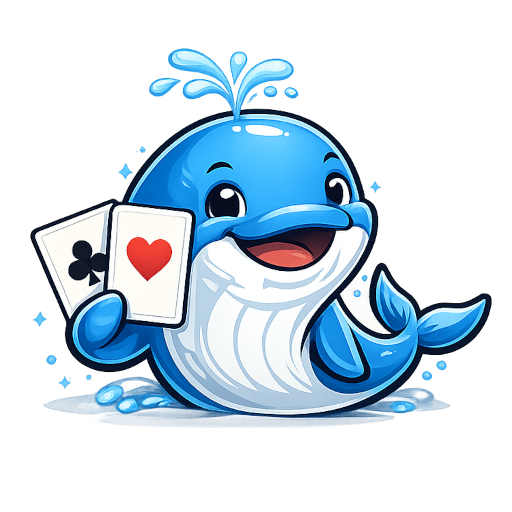
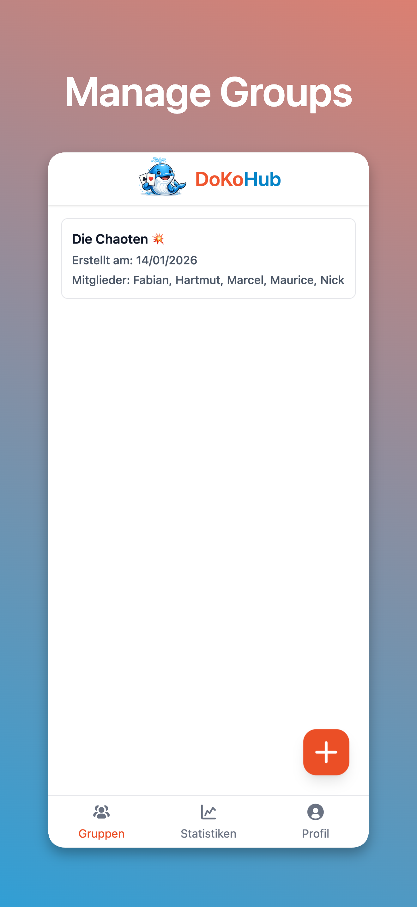
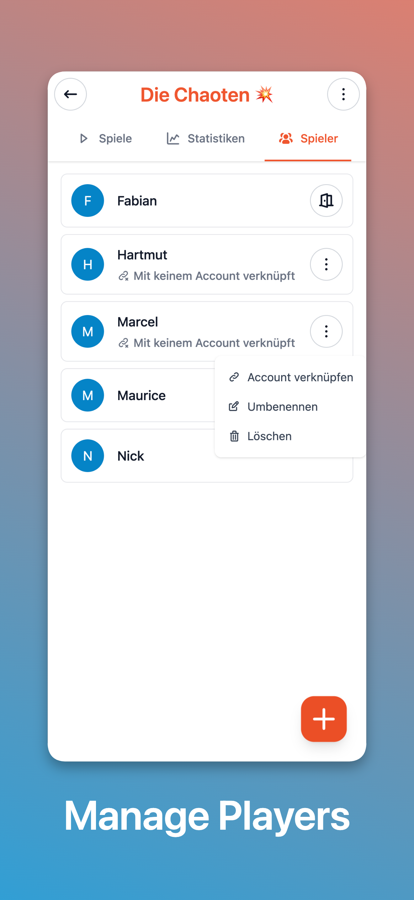
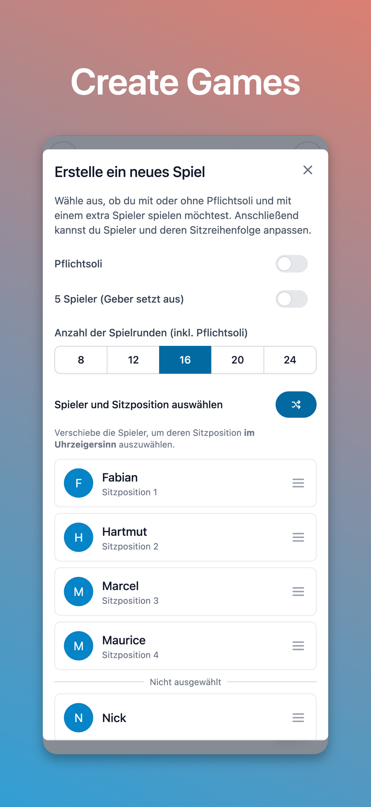
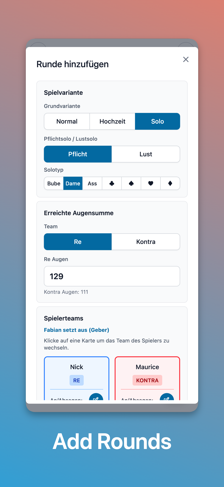
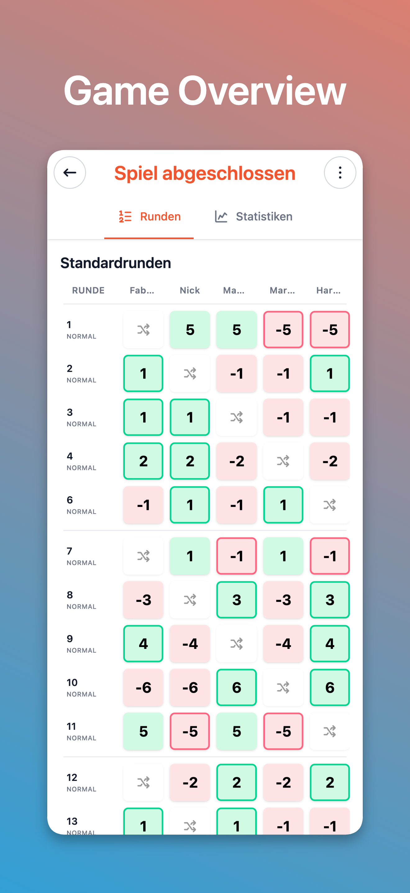
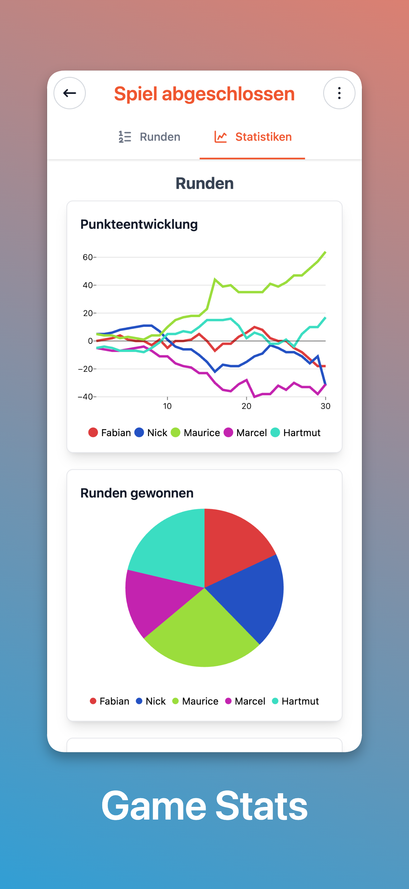

  

# DoKoHub

A web-based scorecard and game management application for tracking **Doppelkopf** card game sessions with groups of players.

  
  
  

  
  
  

## Use cases

DoKoHub is designed for groups of regular card game players who want to:

- **Track games** across multiple sessions with consistent groups
- **Manage players** and their memberships in different groups
- **Record statistics** including rounds, scores, team assignments, and special events (calls, bonuses)
- **Analyze performance** with visual statistics and cumulative scoring charts
- **Invite players** to join groups and participate in games

## Ruleset

Developed based on the official "Tunierspielregeln" (tournament rules) of the "German Doppelkopf-Verband e. V."

## Features

### Group & Player Management

- **OAuth2 based Authentication** via Google
- **Create and manage groups** with multiple players
- **Player types**:
  - **Local players**: Created directly in groups for casual play, no authentication required
  - **Non-local players**: OAuth-authenticated players that can be invited and manage multiple groups
- **Invite system** for adding non-local players to groups via link or QR code

### Game Management

- **Create games** with configurable rules:
  - Customizable number of rounds
  - Mandatory solo rounds (Pflicht-Solo) mode
  - Support for both 4-player and 5-player games (dealer sits out in 5-player format)
  - Configure seating order
- **Track rounds** with full details:
  - Round types: Normal, Hochzeit, Stille Hochzeit
  - Solo variants (Kreuz, Pik, Herz, Karo)
  - Team assignments (Re vs. Kontra)
  - Player calls and announcements (Re, Kontra, K90, K60, ...)
  - Bonuses: Fuchs, Doppelkopf, Karlchen
  - Point calculations with automatic result determination

### Statistics & Analytics

- View stats per game, per group or personal stats
- Point accumulation charts showing cumulative scores per player across rounds
- Team distribution (Re vs. Kontra participation)
- Win/loss records per player
- Performance metrics across multiple games

## Getting Started

- **Development Setup**: See [DEVELOPMENT.md](DEVELOPMENT.md) for detailed setup instructions, available commands, and development guidelines.
- **Production Deployment**: See [DEPLOYMENT.md](DEPLOYMENT.md) for production deployment instructions using Docker Compose or manual setup.
